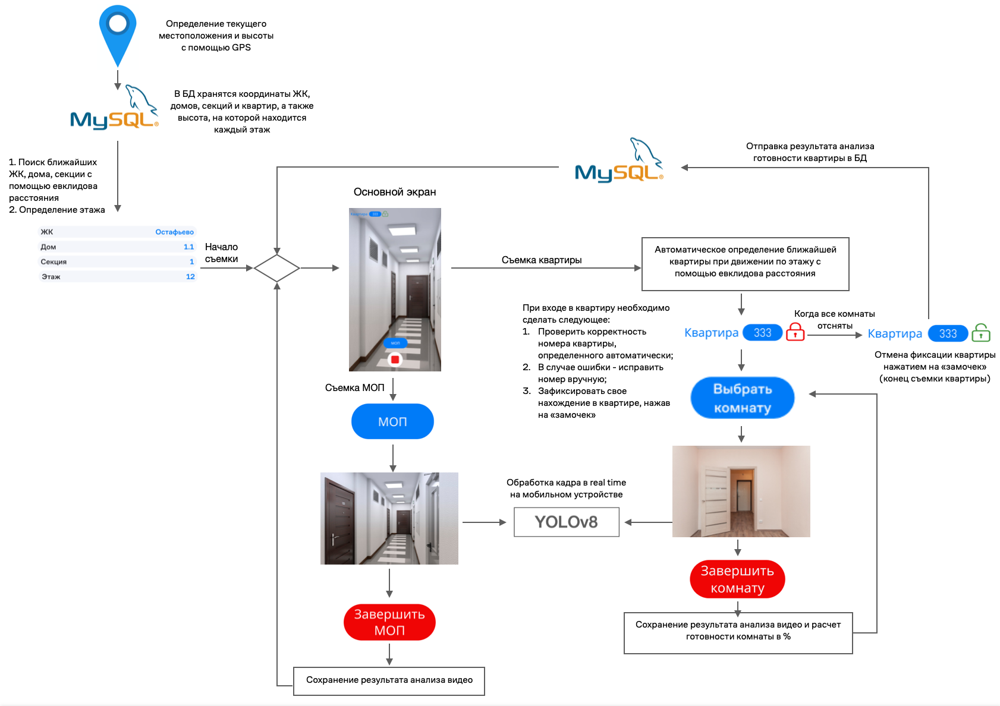
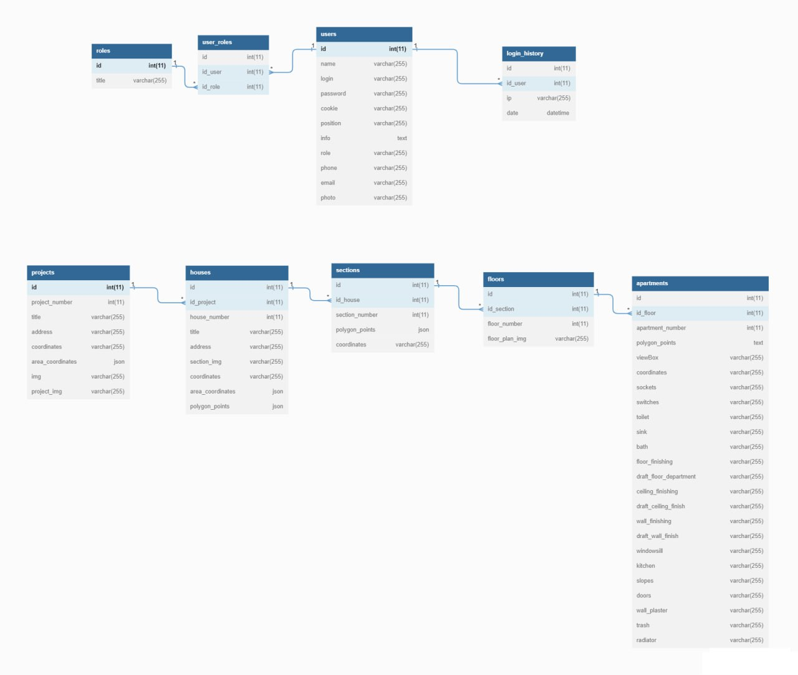
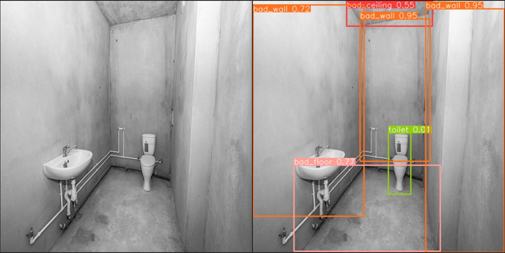
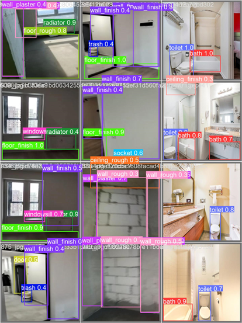

## 
ЗАДАЧА №9 ИНТЕРАКТИВНАЯ ПЛАТФОРМА ДЛЯ МОНИТОРИНГА ВНУТРЕННЕЙ ОТДЕЛКИ КВАРТИРЫ

## 💟 <a name="googledrive">[Ссылка на google drive материалов](https://drive.google.com/drive/folders/1Bl7Yy_IffbnMo5fWqKAvgjcRZAKZbjOb)</a>
## 💟 <a name="train-model">[Ссылка на реализацию обучения модели](https://github.com/MrMarvel/RoomFinalWorkTraining24)</a>

*Сергей Куликов (https://github.com/MrMarvel) - ML-engineer, Mobile-разработчик* 

## Задание

Разработать сервис, позволяющий мониторить процессы внутренней отделки строящихся зданий, который включает:
- разработку ПО, которое позволит собирать данные для автоматизации определения квартир / этажа;
- продуктивное решение для анализа степени готовности квартиры, наличие строительного мусора и т.д. на основе анализа видеопотока;
- сравнение полученных значений с плановыми показателями выполнения работ, расчёт отклонений от плана.

## Решение

Для определения местоположения и анализа готовности помещения я разработал алгоритм, представленный на фото ниже.

Ниже представлена физическая модель нашей базы данных: 

## <a name="11">Работа модели </a>
Ниже представлены скрины работы нашей обученной модели:

## <a name="3">Результат разработки </a>

В ходе решения поставленной задачи нам удалось разработать мобильное приложение, которое имеет следующий функционал:
1. Авторизация пользователя;
2. Запись видео обхода;
3. Анализ видео по кадрам прямо во время съёмки;
4. Просмотр информации по проведенным ранее обходам во всех ЖК;
5. Предусмотрена возможность ручного редактирования автоматически определенного местоположения;
6. Автоматическое заполнение "шахматок" и возможность их скачивания;
7. Просмотр ответов на часто задаваемые вопросы в разделе "Помощь";

Созданное нами решение поможет автоматизировать процесс мониторинга внутренней отделки квартир и МОП.

## <a name="5">Уникальность нашего решения </a>

- Обработка видео происходит на самом устройстве прямо во время съёмки(в real-time);
- Высокая точность детекции объектов/отделки (YOLOv8);
- Удобное мобильное приложение для записи видео обходов;
- Автоматическое определение ЖК, дома, секции, этажа, квартиры с помощью GPS с возможностью правки этих значений вручную, что позволяет сделать определение местоположения очень точным;
- Наличие сайта, на котором можно просматривать информацию о готовности интересующей квартиры;
- Не нужно останавливать запись видео при перемещении между комнатами, квартирами и МОП.
  

## <a name="7">Запуск </a>
Для запуска мобильного приложения необходимо:
1. Скачать с нашего репозитория APK из [гугл диска](#googledrive);
2. Дождаться успешной установки приложения;
3. Открыть приложение, нажав на появившуюся иконку.